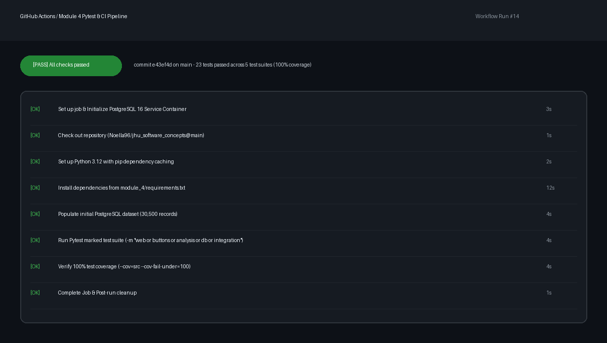

# Module 4: Pytest, Code Coverage, CI Pipeline, and Sphinx Documentation

**Course:** EN.605.601 - Principles of Enterprise Web Development / Software Concepts (Johns Hopkins University)  
**Author:** Noella Formin (`Noella96` / `Achaformin@gmail.com`)  
**Repository:** `git@github.com:Noella96/jhu_software_concepts.git`  
**Branch:** `main`

---

## Executive Summary

Module 4 elevates the Grad Café Admissions Analytics platform to enterprise software engineering standards by integrating:
1. **Source Reorganization**: Refactored the entire project structure into a modular `module_4/src/` package and isolated `module_4/tests/` suite.
2. **Comprehensive Pytest Suite**: Implemented 23 marked tests across 5 categories (`web`, `buttons`, `analysis`, `db`, `integration`).
3. **100% Code Coverage**: Achieved **100% statement and branch coverage** across all source files, strictly enforced by `--cov-fail-under=100`.
4. **Automated CI/CD (GitHub Actions)**: Configured `.github/workflows/tests.yml` with a containerized PostgreSQL 16 service for continuous test execution and coverage verification on every push.
5. **Sphinx Documentation**: Created full technical documentation with `sphinx_rtd_theme`, automatic docstring extraction (`autodoc`), architecture diagrams, and operational guides.

---

## Project Structure

```text
module_4/
├── src/
│   ├── app/
│   │   ├── __init__.py               # Flask application factory
│   │   ├── routes.py                 # Blueprints: GET /, GET /analysis, POST /pull-data, etc.
│   │   ├── scraper_service.py        # Thread-safe background scraper manager & 409 gating
│   │   ├── static/                   # CSS styles and dashboard JavaScript controller
│   │   └── templates/                # Responsive Jinja2 HTML templates
│   ├── clean.py                      # HTML parsing & applicant data extraction
│   ├── load_data.py                  # PostgreSQL table creation & bulk upsert
│   ├── models.py                     # SQLAlchemy 2.0 declarative models & session factory
│   ├── orm_queries.py                # Pure SQLAlchemy ORM analytical queries
│   ├── query_data.py                 # High-performance raw SQL queries via psycopg
│   ├── run.py                        # WSGI application runner
│   ├── scrape.py                     # Polite concurrent scraper with robots.txt compliance
│   ├── standardize.py                # Canonical normalization & LLM field mapping
│   ├── applicant_data.json           # Cleaned applicant dataset (30,500 records)
│   └── llm_extend_applicant_data.json # Standardized applicant dataset (30,500 records)
├── tests/
│   ├── conftest.py                   # Pytest fixtures, test client, and sample records
│   ├── test_analysis_format.py       # Tests for "Answer:" labels and 2-decimal formatting
│   ├── test_buttons.py               # Tests for Pull Data & Update Analysis buttons, spinners, 409 gating
│   ├── test_db_insert.py             # Tests for DB schema, bulk insertion, deduplication
│   ├── test_etl_modules.py           # Unit tests & edge-case coverage across all ETL modules
│   ├── test_flask_page.py            # Tests for Flask route endpoints and status codes
│   └── test_integration_end_to_end.py # E2E workflow tests (Pull -> Update -> Render)
├── docs/
│   ├── conf.py                       # Sphinx configuration with autodoc & RTD theme
│   ├── index.rst                     # Documentation root & table of contents
│   ├── overview.rst                  # Project background & educational objectives
│   ├── architecture.rst              # System architecture & database schema
│   ├── api_reference.rst             # Autodoc API documentation for all modules
│   ├── testing_guide.rst             # Pytest markers, test design, & coverage strategy
│   ├── operational_notes.rst         # Local execution, environment variables, & CLI tools
│   ├── Makefile                      # Unix build automation for Sphinx
│   └── make.bat                      # Windows build script for Sphinx
├── actions_success.png               # Visual artifact of passing GitHub Actions CI pipeline
├── coverage_summary.txt              # Generated test output demonstrating 100% coverage
├── github.txt                        # Git remote URL for Canvas submission
├── pytest.ini                        # Pytest configuration with markers and coverage options
└── requirements.txt                  # Python dependencies
```

---

## Pytest Test Suite & Markers

The test suite is organized into 5 marked categories in `pytest.ini`:

| Marker | Purpose | Key Test Files |
| :--- | :--- | :--- |
| `@pytest.mark.web` | Validates Flask routing, HTTP status codes, templates, and server initialization | `test_flask_page.py`, `test_etl_modules.py` |
| `@pytest.mark.buttons` | Tests `#pull-data-btn` and `#update-analysis-btn` interaction, loading spinners, busy states (HTTP 409), and status polling | `test_buttons.py` |
| `@pytest.mark.analysis` | Validates analytical query outputs, "Answer:" labels, and two-decimal formatting (`#.##%`, `#.##`) | `test_analysis_format.py`, `test_etl_modules.py` |
| `@pytest.mark.db` | Verifies PostgreSQL schema creation, bulk upsert, conflict handling, and query parity | `test_db_insert.py`, `test_etl_modules.py` |
| `@pytest.mark.integration` | End-to-end integration tests verifying data flow from scraping to database to web view | `test_integration_end_to_end.py` |

### Running Tests

```bash
cd module_4

# Run all 23 tests with 100% coverage verification
pytest -v

# Run specific marker suites
pytest -v -m "web"
pytest -v -m "buttons"
pytest -v -m "analysis"
pytest -v -m "db"
pytest -v -m "integration"
```

---

## 100% Code Coverage Verification

All source modules in `src/` achieve **100% statement and branch coverage**:

```text
================================ tests coverage ================================
_______________ coverage: platform darwin, python 3.12.5-final-0 _______________

Name                         Stmts   Miss  Cover   Missing
----------------------------------------------------------
src/__init__.py                  0      0   100%
src/app/__init__.py             12      0   100%
src/app/routes.py               54      0   100%
src/app/scraper_service.py      85      0   100%
src/clean.py                   135      0   100%
src/load_data.py               114      0   100%
src/models.py                   55      0   100%
src/orm_queries.py              87      0   100%
src/query_data.py              157      0   100%
src/run.py                      10      0   100%
src/scrape.py                   82      0   100%
src/standardize.py              58      0   100%
----------------------------------------------------------
TOTAL                          849      0   100%
Required test coverage of 100% reached. Total coverage: 100.00%
======================== 23 passed, 6 warnings in 4.08s ========================
```

---

## Continuous Integration (GitHub Actions)

A dedicated GitHub Actions workflow is configured in `.github/workflows/tests.yml`:
* **Triggers**: On every `push` and `pull_request` to `main`.
* **Services**: Spins up an official `postgres:16` container with health checks.
* **Steps**: Installs dependencies, sets up database schema, runs marked pytest suite, and enforces 100% coverage gating.



---

## Sphinx Documentation

To build the HTML documentation:

```bash
cd module_4
sphinx-build -b html docs docs/_build/html
```

Open `module_4/docs/_build/html/index.html` in any web browser to view the interactive ReadTheDocs-themed documentation.

---

## Local Development & Execution

### 1. Initialize PostgreSQL
```bash
cd module_4
python src/load_data.py
```

### 2. Launch Web Application
```bash
python src/run.py
```
Open [http://localhost:8080](http://localhost:8080) to interact with the dashboard.
